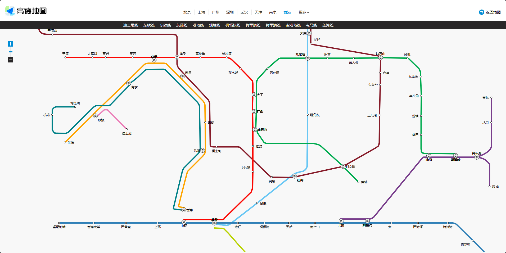
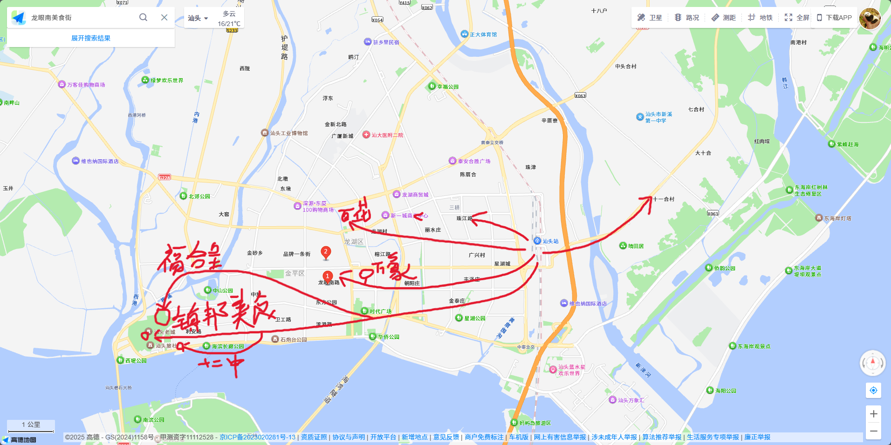
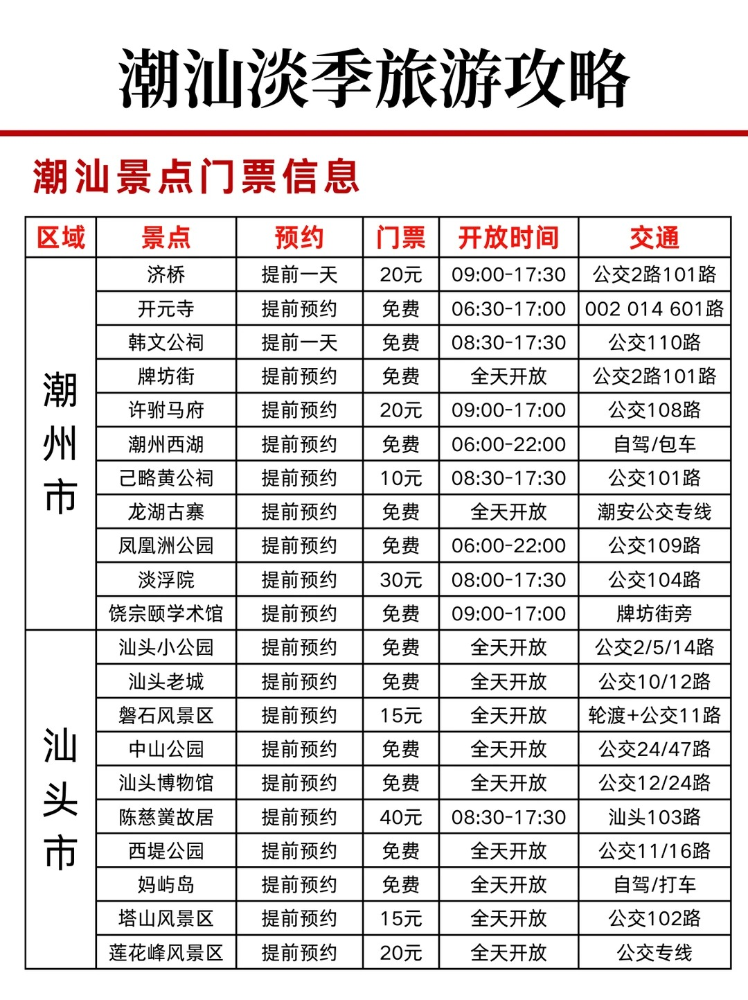
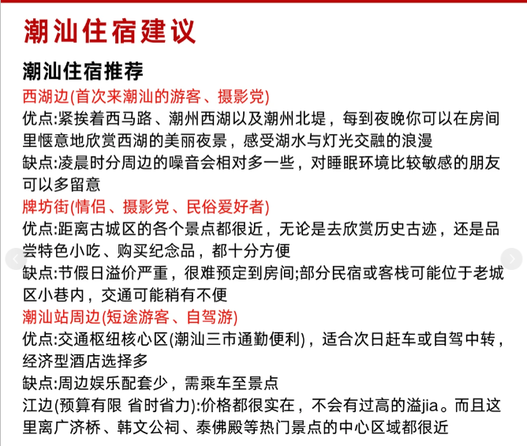
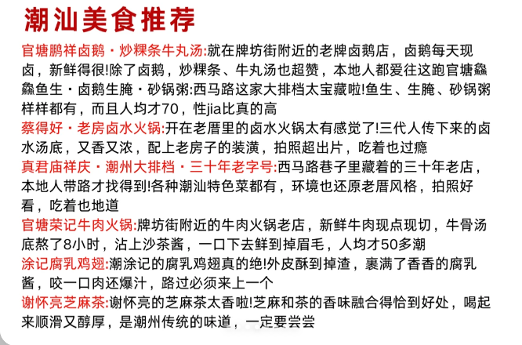

# 旅游指南

> 备注信息  
> 澳门：买流量卡  
> 香港：买流量卡、换一些纸币  
> 飞机航空：允许携带小包装的沐浴露、洗发水、牙膏，只允许携带空水杯  
> 行李1：衬衫、内裤、袜子均两件；洗发水、沐浴露、牙膏小袋包装  
> 行李2：牙刷；睡衣一套；纸巾一包 ；充电宝一个   
> 22号晚上收拾好行李，第二天早上出发    
> 六点起床、到清鸥府集合、坐地铁到飞机场      
> 登机是在航站楼T3

## 12月23日 澳门（第一天）

#### 行程：贵阳 -> 澳门 🛫

#### 时间：9:00 a.m. - 10:21 a.m.

错峰出行，白天我们先根据下飞机的位置，先到氹仔岛游玩  
顺序是：

- 氹仔岛：美狮美高梅、伦敦人、巴黎人、威尼斯人、官也街、澳门银河酒店【坐发财车回拱口北岸】
- 拱口北岸：新葡京【坐发财车前往】、议事亭前地、玫瑰圣母堂、恋爱巷、大三巴、大炮台、疯堂斜巷、东望洋新街、加思栏花园、永利澳门、澳门美高梅
- 口岸通关时间：拱北口岸 06:00 - 次日 01:00、港珠澳大桥口岸 08:00 - 22:00
- 发财车服务：澳门银河钻石大堂对面有免费穿梭巴士到关闸（拱北口岸），09:00 - 23:30，10 - 15 分钟一班
- 最后返程，看是坐发财车出境、还是徒步回拱北口岸
- 去珠海住酒店

参考链接：

1. 84 【澳门穷游攻略‼️人均200💰直接速抄作业🔥 - 小薯片消灭 | 小红书 - 你的生活兴趣社区】 😆 zbnFN6emFwljGd9
   😆 https://www.xiaohongshu.com/discovery/item/690f06ad000000000401183e?source=webshare&xhsshare=pc_web&xsec_token=AB0J3dPEccdJHuazOMglb4o2pPpdLARy7CdHqGbf5BKx8=&xsec_source=pc_share

2. 71 【🇲🇴澳门一日游超全攻略 | 保姆级教程 - MilkaBaka. | 小红书 - 你的生活兴趣社区】 😆 mMkIhnQjYlxVQpT
   😆 https://www.xiaohongshu.com/discovery/item/68546b670000000022032fea?source=webshare&xhsshare=pc_web&xsec_token=AB_aXZsCMG9A9kH1B05yF7Jvfkk1HCMXdl3eky1ZB2PKM=&xsec_source=pc_share

## 12月24日 香港（第二天）

#### 行程：珠海 -> 香港 🚌

#### 时间：9:00 a.m. - 10:00 a.m.

注意事项：

- 携带充电宝，游玩时间可能比较长，涉及到拍照、视频等等内容。

- 换一些港币，叮叮车和一些老店只收港币

| 地点              | 时间            | 花费       | 出行方式   | 备注                               |
| --------------- | ------------- | -------- | ------ | -------------------------------- |
| 粤港澳大桥香港口岸 - 旺角站 | 30min         | 刷支付宝     | 公交车    | 找地标可以看见A21路公交车站                  |
| 旺角              |               |          | 步行     | B3口打卡过桥天桥网红机位；B2口可以到达女人街、波鞋街、金鱼街 |
| 旺角点点心           |               |          | 步行     | B2口可以吃到点心                        |
| 油麻地             |               |          | 地铁/步行  |                                  |
| 尖沙咀             |               |          | 地铁     | J2口出，导航星巴克，对面就是麦兜；再沿着海岸线走到K11    |
| K11             |               |          | 步行     | 漂亮的商场                            |
| 维多利亚港           |               | 刷码，消费5港币 | 天星小轮   | 沿河岸边一直走，就可以看到天星码头                |
| 天星码头中环摩天轮       |               | 20港币     |        | 需要提前在网上买票才能有玩，或者是在旁边拍照           |
| 中环city work     |               |          | 步行     | 中环街市-兰芳园-艺穗会-bakehouse-fine粉红    |
| 坚尼地域            |               |          | 叮叮车/地铁 | 中环坐车                             |
| 西营盘             |               |          | 地铁     | 地铁B1口，看海                         |
| 铜锣湾             |               |          | 地铁     | 地铁D1口，晚间街市                       |
| 太平山顶            | 19:30 - 21:30 | 往返88港币   | 缆车     | 在携程上购票                           |
| 西九龙高铁站          |               |          | 地铁     | 从中环上车，坐到佐敦，向左走到西九龙高铁站，乘坐高铁返回深圳北  |

#### 参考图

参考链接：

1. 81 【珠海出发｜香港一日攻略笔记 - 十口一只羊 | 小红书 - 你的生活兴趣社区】 😆 oDByQtU5FKBd719
   😆 https://www.xiaohongshu.com/discovery/item/6878e351000000002203f230?source=webshare&xhsshare=pc_web&xsec_token=AB1tVYn5E2PN8O8qyMuJqXKrEPhT9k_Ztjc-Xjv5BivSY=&xsec_source=pc_share

2. 15 【深圳北出发—香港一日游完整攻略！（收藏版） - 橘子的深圳生活 | 小红书 - 你的生活兴趣社区】 😆 txBu7DgPcfNKgQv
   😆 https://www.xiaohongshu.com/discovery/item/68e776670000000007009059?source=webshare&xhsshare=pc_web&xsec_token=ABhZYdzPp5wFdUu2X9avflpHkRy85d16RZpZFZYPX2oGQ=&xsec_source=pc_share

## 12月25-26日 潮汕（第三、四天）

#### 行程：深圳北 -> 汕头 🚅

#### 时间：10:00 a.m. - 12:00 a.m.

#### 住宿：

-  建议住十一合村周围，临近公园、树林，不吵

- 情况，当天吃一天、第二天吃一天、需要住两天

来到这里主要就是吃喝玩乐+徒步

公园和博物馆游玩

小馆子吃饭、小吃等等内容，满足味蕾的期待😋😋

美食目标：

- 粥底火锅

- 鱼生

- 潮汕牛肉丸

| 地点      | 时间  | 花费   | 出行方式   | 备注                                                                                                                  |
| ------- | --- | ---- | ------ | ------------------------------------------------------------------------------------------------------------------- |
| 龙眼南美食街  | 一天  | 刷支付宝 | 打车/公交车 | 1. 潮汐牛肉 2. 番薯芋头 3. 瑞娇嬷嬷生腌 4.长平肠粉 5. 揭阳老牌腐乳鸡翅 6. 伟顺反沙屋 7. 海记猪血汤 8. 盛记鹅肉 9. 老胡甜汤  |
| 十一合村    |     |      |        | 鸡煲、芋头、竹笋馃                                                                                                           |
| 珠江路美食街  |     |      |        | 牛肉火锅、肠粉、猪肚、干面                                                                                                       |
| 百花路     |     |      |        | 糯米、卤鹅、菜头丸                                                                                                           |
| 镇邦美食街   |     |      |        | 猪脚饭、蚝烙、冰室、广场豆花                                                                                                      |
| 福合呈     |     |      |        | 玉兰肥姐、家常牛肉、甜汤                                                                                                        |
| 万象城     |     |      |        | 觅食燕生腌、生记肠粉、烤鲜牛、新兴牛肉店                                                                                                |
| 跃进路和十二中 |     |      |        | 如如糯米、阿雄牛肉丸、跃进炒糕馃、十二中草莓冰                                                                                             |

美食建议：

- 早餐：牛肉粿条、馃汁、粿条汤、咸水馃、肠粉、猪血汤、豆浆、蚝烙、牛肉丸、干面、捞饺、海鲜捞面

- 正餐：鱼生、生腌、鱼饭、卤鹅、海鲜砂锅粥、牛肉火锅、猪脚饭、牛杂牛腩饭、煲仔饭、卤水火锅、猪肚汤、土鸡火锅、

- 小吃：腐乳鸡翅、各种馃、甘草水果、冬瓜茶、甜汤、牛肉炒粉签

- 特产：丸子、反沙三味、虾膏、风吹饼、猪肉脯、腊肠

路线图：

参考图：

参考链接：

1. 24 【🔥12-2月潮汕淡季冲！保姆级攻略来咯 - 心情不太好. | 小红书 - 你的生活兴趣社区】 😆 70nZ6aYHYlfYFtn
   😆 https://www.xiaohongshu.com/discovery/item/693a72c8000000001e037c30?source=webshare&xhsshare=pc_web&xsec_token=ABceoGHVjuLRby6-iml-FYxxkAetz-B9msZWVmUP_SeS4=&xsec_source=pc_share
2. 73 【吃货必看！！汕头美食纯吃攻略 全是干货 - 吃货阿王逛吃逛吃 | 小红书 - 你的生活兴趣社区】 😆 vvKk0basZjZ8peE
   😆 https://www.xiaohongshu.com/discovery/item/691194150000000004016608?source=webshare&xhsshare=pc_web&xsec_token=ABZu-aA2IejnqdQu59Ymmz8xYGuYyuaen1grhnHNbxaU4=&xsec_source=pc_share

## 12月27日 贵阳（返程）

#### 行程：汕头 -> 深圳北 -> 贵阳北 -> 回家🚅

#### 时间：9:31 a.m. - 12:16 a.m. 汕头 -> 深圳北

#### 时间：12:27 a.m. - 17:02 a.m. 深圳北 -> 贵阳北
